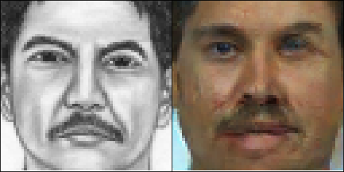

   

Dieses Repository enthält den Code zu meiner Masterarbeit über Transfer-Learning für Generative Adversarial Networks.
Der Code basiert grundlegend auf der pix2pix und CycleGAN pytorch-Implementierung von junyanz: https://github.com/junyanz/pytorch-CycleGAN-and-pix2pix (für dessen README siehe ``README_old.md``)

# Datensätze

Um insbesondere die sketch-face Datensätze zu rekonstruieren wird zum einen die ColorFERET-Datenbank benötigt: https://www.nist.gov/itl/iad/image-group/color-feret-database
Außerdem werden die dazugehörigen Zeichnungen benötigt: http://mmlab.ie.cuhk.edu.hk/archive/cufsf/

Die sketch-face(-64 und -128) und die face-recognition-Datensätze (für die Evaluation) können anschließend mit dem Skript in ``datasets/preprocessing/make.py`` erstellt werden:
``python -m datasets.preprocessing.sketch_face.make --num_workers 8 --colorferet_directory /home/y2g/jupyter/preprocessing/feret``

Der celebA-Datensatz wurde mit dem Jupyter-Notebook aus ``jupyter-notebooks/celeba_edges/edges.ipynb`` erzeugt.

# Experimente

Die Datei ``experiments/experiments.yaml`` definiert alle durchgeführten Experimente mit den jeweils variierenden Parametern. Damit können Experimente (ohne Transfer-Learning) wie bspw. so durchgeführt werden: ``./experiments/run.py --phase train --name lf --gpu 0``
Damit wird dann automatisch das Training für das Experiment ``lf`` ausgeführt.
Mit dem Befehl ``./experiments/run.py --phase test --name lf --gpu 0 --cover`` können anschließend die Test-Bilder für alle gespeicherten Epochen erzeugt werden.
Transfer-Learning-Experimente können wie folgt durchgeführt werden, wenn das dazugehörige Pretraining (siehe ``experiments.yaml``) bereits durchgeführt wurde: ``./experiments/run.py --phase transfer --name t9_1 --gpu 0``

# Evaluation
Voraussgesetzt der sketch-face-Datensatz wurde erzeugt, so können die Evaluationsmetriken trainiert werden (siehe ``evaluation/train_classifier.sh``)
Anschließend kann eine Evaluationsmetrik mit einem bestimmten Modell (bspw. mit ``run_all_fr_evaluations.py`` auf alle Ergebnisse der Sketch-Face-Experimente ausgeführt werden (hier für die gleichen Konfigurationen wie in der Arbeit):
- FR20: ``./run_all_fr_evaluations.py --model_name 20_lr0.002_bs8``
- FR10: ``./run_all_fr_evaluations.py --model_name 10_lr0.004_bs16``
- FR5: ``./run_all_fr_evaluations.py --model_name 5_lr0.004_bs8``

